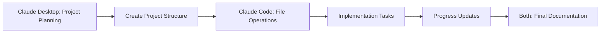

# Claude Code + Claude Desktop Collaboration via Basic Memory

> **Revolutionary workflow enabling asynchronous collaboration between Claude Code (CLI) and Claude Desktop (GUI) through shared persistent memory**


## 🚀 What This Enables

This setup creates a **shared knowledge base** that allows Claude Code and Claude Desktop to:

- 📝 **Persistent Memory**: Maintain context across different Claude interfaces
- 🤝 **Asynchronous Collaboration**: Claude Desktop can research, Claude Code can implement
- 🧠 **Knowledge Building**: Accumulate institutional knowledge over time
- 🔄 **Seamless Handoffs**: Research → Implementation → Documentation workflows
- 📁 **Organized Knowledge**: PARA method integration with Obsidian

## 🎯 Use Cases

### Research → Implementation
1. **Claude Desktop** researches a complex topic, creates comprehensive notes
2. **Claude Code** reads the research and implements code solutions
3. Both document findings for future reference

### Project Continuity
- Start a project in Claude Desktop (planning, architecture)
- Continue implementation in Claude Code (file operations, coding)
- Maintain full context across sessions

### Knowledge Management
- Build a personal knowledge base that both Claudes can access
- Create interconnected notes following the PARA method
- Automatic sync with Obsidian for powerful note-taking

## 🛠 Quick Start

### Prerequisites
- Claude Desktop installed
- Claude Code CLI access
- macOS (Linux/Windows support coming)

### Installation
```bash
# Install Basic Memory
curl -LsSf https://basicmemory.com/install/latest.sh | sh

# Configure for Obsidian (optional but recommended)
uvx basic-memory project add obsidian "~/Documents/Obsidian Vault"
uvx basic-memory project default obsidian
```

### Configuration
Add to `~/Library/Application Support/Claude/claude_desktop_config.json`:
```json
{
  "mcpServers": {
    "basic-memory": {
      "command": "/Users/yourusername/.local/bin/uvx",
      "args": ["basic-memory", "mcp"]
    }
  }
}
```

**Restart Claude Desktop** and you're ready to collaborate!

## 📋 Complete Setup Guide

See [SETUP.md](./SETUP.md) for detailed step-by-step instructions.

## 🔄 Example Workflows

### Workflow 1: Research and Implementation


### Workflow 2: Project Planning


## 📁 Recommended Folder Structure (PARA Method)

```
Knowledge Base/
├── 1. Journal/           # Daily entries
├── 2. Projects/          # Active work
│   ├── claude-coordination/  # Inter-Claude communication
│   └── [your-projects]/
├── 3. Areas/             # Life domains
├── 4. Resources/         # Reference materials
└── 5. Archives/          # Completed items
```

## 💡 Real Examples

### Example 1: Code Documentation
**Claude Desktop** analyzes complex code and creates architectural notes:
```markdown
# API Architecture Analysis
## Overview
The system uses a microservices pattern with...
## Key Components
- Authentication service
- Data processing pipeline
## Recommendations
- Consider adding rate limiting
- Improve error handling in...
```

**Claude Code** reads the notes and implements improvements:
```bash
# Read the analysis
uvx basic-memory tool read-note "API Architecture Analysis"

# Implement the recommendations
# (file operations, code changes, testing)

# Document the implementation
uvx basic-memory tool write-note --title "API Improvements Implementation" \
  --folder "Projects" --content "Implemented rate limiting and error handling..."
```

### Example 2: Learning and Research
**Claude Desktop** creates comprehensive learning notes, **Claude Code** implements practice projects based on the research.

## 🔧 Advanced Features

### CLI Commands (Claude Code)
```bash
# Create notes
uvx basic-memory tool write-note --title "Note Title" --folder "Projects" --content "Content"

# Read notes
uvx basic-memory tool read-note "note-identifier"

# Search knowledge base
uvx basic-memory tool search-notes "search terms"

# Get context for continuing work
uvx basic-memory tool build-context
```

### MCP Integration (Claude Desktop)
- Create notes through conversation
- Search and reference existing knowledge
- Build upon previous research automatically

## 🤝 Contributing

We welcome contributions! Please see [CONTRIBUTING.md](./CONTRIBUTING.md) for guidelines.

## 📄 License

MIT License - see [LICENSE](./LICENSE) for details.

## 🙏 Acknowledgments

- [Basic Memory](https://basicmemory.com) - The backbone of this collaboration system
- [Anthropic](https://anthropic.com) - For creating both Claude interfaces
- PARA Method - For the organizational framework

## 📞 Support

- 🐛 **Issues**: [GitHub Issues](https://github.com/yourusername/claude-basic-memory-workflow/issues)
- 💬 **Discussions**: [GitHub Discussions](https://github.com/yourusername/claude-basic-memory-workflow/discussions)
- 📚 **Documentation**: [Wiki](https://github.com/yourusername/claude-basic-memory-workflow/wiki)

---

**⭐ Star this repo if you find it useful!**

*This workflow represents a new paradigm in AI collaboration - leveraging multiple interfaces of the same AI system for complex, multi-faceted projects.*